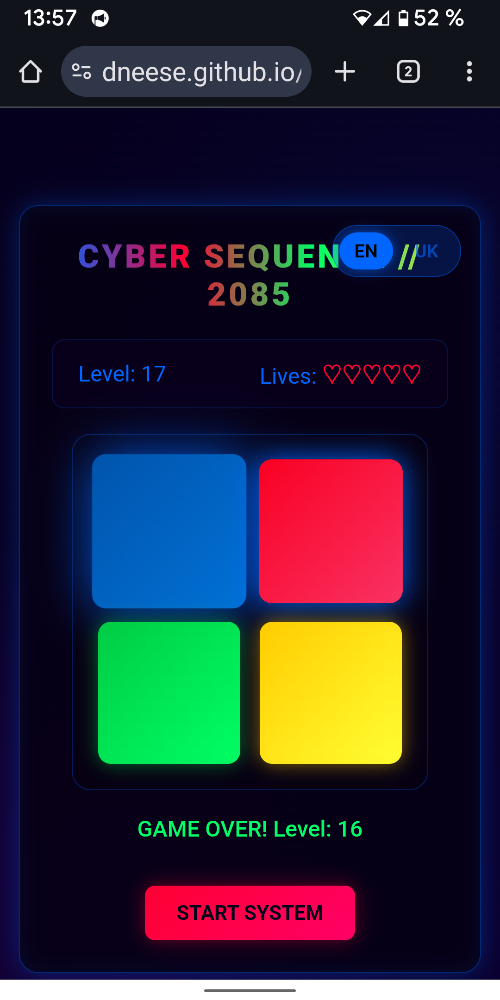

# 🎮 Cyber Sequence // 2085

A cyberpunk memory game with neon visuals and procedural music.  
Футуристична гра на пам’ять з неоновими візуалами та procedural музикою.

[English](#english) | [Українська](#українська)  
[Play Now](#play-now) | [Features](#features) | [How to Play](#how-to-play) | [Installation](#installation)

  


## Features / Фічі {#features}
- 🎨 Neon design, responsive / Неоновий дизайн, адаптивний  
- 🎵 Procedural soundtrack / Procedural саундтрек  
- 🎮 Simon-style, 5 lives / Стиль Simon, 5 життів  
- 🌐 EN/UK support / Підтримка EN/UK  
- 📱 Browser-based / У браузері  

## How to Play / Як грати {#how-to-play}
1. Watch the sequence / Спостерігай послідовність  
2. Repeat by clicking / Повтори кліками  
3. It grows, speeds up / Вона росте, прискорюється  
4. 5 lives — stay sharp! / 5 життів — будь уважним!  

**Controls / Керування**: Click pads, switch EN/UK top-right, start button.  
Клік по панелях, перемикання мови вгорі праворуч, кнопка старту.

## Play Now / Грайте зараз {#play-now}
[Play Demo](https://dneese.github.io/cyber-sequence/)

## Installation / Інсталяція {#installation}
```bash
git clone https://github.com/dneese/cyber-sequence.git
cd cyber-sequence
python -m http.server 8000  # http://localhost:8000
```

## Contributing / Співпраця {#contributing}
Fork, edit, PR. Ideas: languages, themes.  
Форкни, зміни, PR. Ідеї: мови, теми.

## License / Ліцензія {#license}
MIT — see [LICENSE](LICENSE).  
Copyright (c) 2025 Dneese.

## Author / Автор {#author}
[DNeese](https://github.com/dneese)

Made with ❤️ in neon 2085 / Зроблено з ❤️ у неоні 2085.
